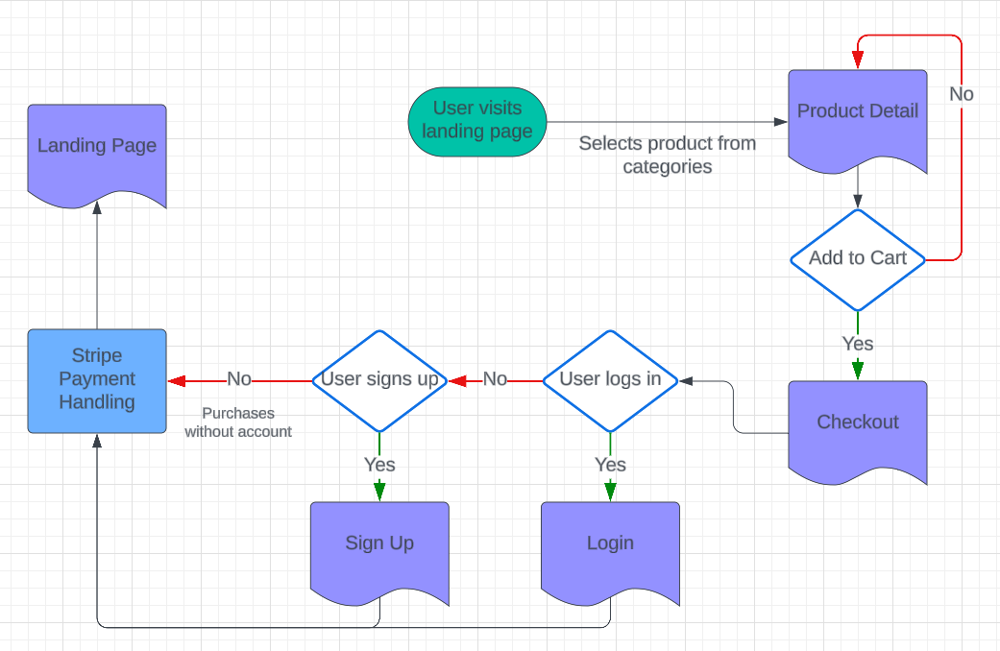
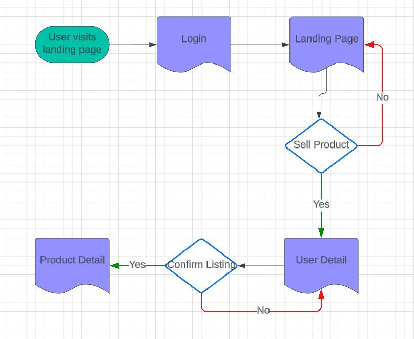

## PishPosh (an e-commerce site)

#### Page Overview

###### All Pages

All pages will have a navbar that takes the user to the homepage. They will also allow a user to log in and out as well as sign up.

###### Landing Page

This is where the user will land when they first go to the URL.

This page is mapped to the root URL.

This page will have a navbar that lists different categories of products and will also display products based on the category selected.

###### Product Page

The Product page will host a single product listing. It will also list the seller of the product and allow the user to purchase the item.

###### Sign Up Page

The sign up page will be where users can make an account (username and password) to use PishPosh. They'll need to enter at their first name and optionally their last name.

###### Login Page

The login page will allow returning users to login and make purchases or post listings.

###### Cart Page

The cart page will fill up with items the user selected to purchase. This page will update automatically with whatever the user has decided they want to checkout.

###### Checkout Page

Here the user will finalize their purchase and enter payment information.

The payment information will be processed through the Stripe Dev API to simulate an actual transaction.

###### API Page

This page will allow users to make and recieve the results of API calls to the PishPosh API.

This page will make calls to the backend to get the requisite information.

#### API Routes

GET /v1/products

**Meaning:** Will get all products and their IDs as well as the userID of the seller

**Response:** {"Products" : [{"productID", "productname", "userID"}, ...]}

**Response Code:** 200

GET /v1/products/<productID>

**Meaning:** Will get one product based on a valid product ID

**Response:** {"Product": {"productID", "productname", "userID"}}

**Response Code:** 200

GET /v1/users

**Meaning:** Will get all usernames, their IDs, and their first and last names (last name optional)

**Response:** {"Users" : [{"userID", "username", "firstname", "lastname"}, ...]}

**Response Code:** 200

GET /v1/users/<userId>

**Meaning:** Will get one user based on a valid user ID and the products they've listed

**Response:** {"User": {"userID", "username", "firstname", "lastname", "products"}}

**Response Code:** 200

GET /v1/tags

**Meaning:** Will get all tags and their IDs

**Response:** {"Tags" : [{"tagID", "tagname"}, ...]}

**Response Code:** 200

GET /v1/tag/<tagID>

**Meaning:** Will get one tag based on a valid tag ID and the product IDs they're attributed to

**Response:** {"Tag": {"tagID", "tagname", "products"}}

**Response Code:** 200

#### User Flows

# Buying Flow

# Selling Flow

